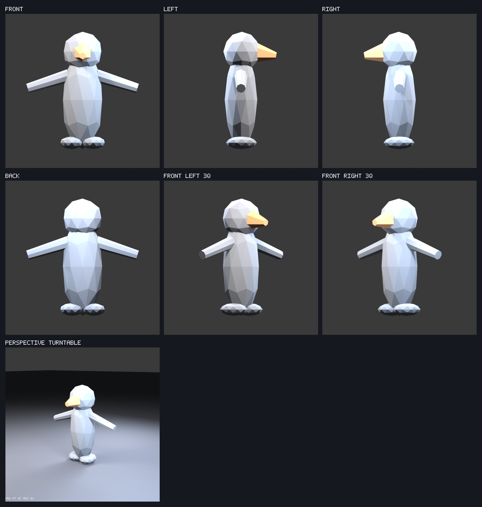

# Full-3D lemur — Prompt 01, revision 01

## Visual entry point

Full-resolution renders: [front](front.png), [left](left.png), [right](right.png), [back](back.png), [front-left three-quarter](front-left-three-quarter.png), [front-right three-quarter](front-right-three-quarter.png), and [locked perspective turntable start](perspective-turntable.png).

## Scope and decisions

- This is an isolated, intentionally minimal full-volume pipeline diagnostic. It does not replace or modify the production lemur and it is not an anatomy proposal.
- Blender uses meters, `+Z` up, `+X` right, `-Y` forward, and a ground plane at `Z = 0`.
- The intended future modeling pose is a relaxed A-pose with an extended tail. The diagnostic opens the arms so arm span, volume, symmetry, and identical orthographic framing are easy to judge.
- All six orthographic cameras use scale `3.6` and `512 × 512` output. The separate 55 mm perspective camera is locked at the turntable start angle.
- Neutral key, fill, and rim lights use fixed transforms and energies. Exact camera, lighting, render, Blender, color-management, bounds, and count data are in [metrics.json](metrics.json).

## Measurements and checks

- Height: `2.74` m; arm span: `2.625621` m; diagnostic depth: `1.242397` m.
- Intended seated footprint for later proportion work: `1.4 m × 1.25 m`.
- GLB: `39616` bytes, `212` vertices, `396` triangles, `2` primitives, `2` materials.
- The generator exports twice internally and confirmed byte-identical GLBs: `1784ca81984e963f8a7a93310381cd40b460c036dbf29cb8196113a85963b963`.
- The production `public/models/lemur.glb` SHA-256 remained `3a8833d7d0e19a33f378da8133f945e66ce79ac5eb85ba85c4d3e6cee4f52f47` before and after generation. The scoped build command also guards every unselected manifest output.
- Required object names, material names, finite position bounds, PNG signatures, and deterministic repeat export are validated by the manifest workflow.
- Review filenames and JSON key order are fixed in source; every accepted attempt uses a new prompt/revision directory.

## Rebuild

Run `npm run assets:build:lemur-full-3d` from the repository root. The expanded command is `npm run assets:build -- --asset lemur-full-3d`. No manual Blender action is required. Validate the existing output alone with `npm run assets:validate -- lemur-full-3d`.

## How to verify

1. Run `npm run assets:validate -- lemur-full-3d`.
2. Inspect this contact sheet and every linked full-resolution render. Confirm consistent framing and neutral lighting.
3. Run `npm run dev`, open `http://localhost:5173/?review=lemur-full-3d`, reset to all six canonical directions, and orbit one full revolution.
4. Confirm real depth and the unambiguous `-Y` forward cue. Do not judge anatomy, topology, markings, rigging, or animation in Prompt 01.
5. Approve or reject **Prompt 01 revision 01** explicitly, naming any failed direction or review condition.

## Changes from previous approved revision

None. This is the first review packet and establishes the staging pipeline, framing, cameras, neutral lighting, measurements, and coordinate contract.

## Known limitations

- The diagnostic deliberately has no finished anatomy, topology, markings, rig, or animation.
- Its closed component volumes are joined into one mesh object but are not yet unified deformation topology.
- The perspective camera records the locked turntable start view only; turntable animation belongs to later visual review work.

## Review gate

Approve or reject only the isolated pipeline, framing, locked cameras, neutral lighting, coordinate convention, and whether the diagnostic reads as genuinely volumetric from every supplied view. Automated checks do not approve this gate.
