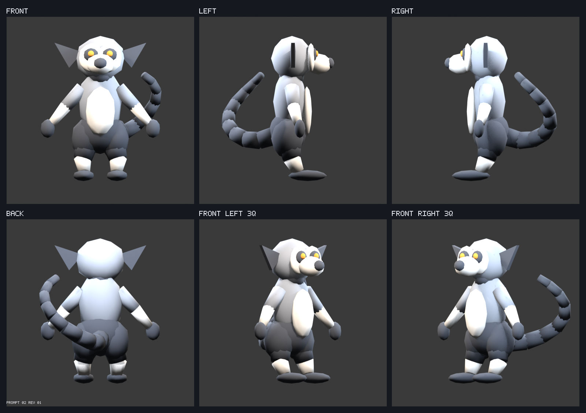

# Full-3D lemur — Prompt 02, revision 01

## Visual entry point

Start with the [reference crop beside the front render](reference-comparison.png), then inspect the [transparent silhouette and landmark overlay](reference-overlay.png). Review the [front](front.png), [left](left.png), [right](right.png), [back](back.png), [front-left three-quarter](front-left-three-quarter.png), [front-right three-quarter](front-right-three-quarter.png), and [eight-angle turntable sheet](turntable-contact-sheet.png).

## Scope and design decisions

- The diagnostic was replaced by complete primary volumes: skull, projecting muzzle, neck, ribcage, belly, pelvis, arms, hands, haunches, legs, feet, ears, eyes, and a fully modeled tapered tail.
- The relaxed A-pose keeps joint clearance for shoulder, hip, wrist, ankle, and tail deformation. Separate closed components are intentional until Prompt 03 builds unified topology.
- The reference controls the compact head, large triangular ears, long tapered torso, facial focus, and ring-tailed-lemur identity. It does not define hidden anatomy.
- Deliberate unseen-anatomy decisions include a deep cranium, projecting muzzle, compressed ribcage, broad haunch support, elliptical limbs, plantigrade feet, and a raised tail attached behind the pelvis.
- The tail is the only intentional asymmetry. It curves behind and toward character right so attachment, taper, and length remain judgeable.
- Final facets, markings, fingers, deformation topology, rigging, and the seated pose are deferred to their named prompts.

## Measurements and checks

- Height: `2.79` m; arm span: `2.3` m; overall width/depth: `2.315066` m / `2.161916` m.
- GLB: `87616` bytes, `1926` exported vertices, `2104` triangles, `30` primitives, and `4` materials. The source meshes contain `1128` vertices, `1666` base faces, and `38` intentional closed components.
- Every mesh edge has exactly two face users: `True`. Per-volume results are recorded in `mesh.volume_checks` in [metrics.json](metrics.json).
- Intended paired forms use identical dimensions and mirrored X coordinates; maximum authored deviation is `0.0 m`. The curved tail is documented asymmetry.
- The planned rig has 54 bones, 46 deform bones, and at most 4 weighted influences per vertex. These are descriptive design targets, not web budgets.
- The generator exported twice internally and confirmed byte-identical GLBs: `65c3dc67a3830d10b17041c0d3627bcf7e23599b7af061d80fb42f7fee3d5feb`.
- The production `public/models/lemur.glb` remained `3a8833d7d0e19a33f378da8133f945e66ce79ac5eb85ba85c4d3e6cee4f52f47` before and after generation.

## Reference comparison and deliberate departures

The cropped comparison preserves `images/yoge-lemur.png` unchanged. The orange outline in the overlay is a transparent landmark/silhouette guide from the seated perspective reference; blue crosses mark the face, shoulders, torso, and pelvis/tail axis. The rigging pose deliberately opens the arms, straightens the legs, lifts the torso, and raises/extends the tail. Side and back depth are authored rather than inferred as orthographic truth.

## Rebuild

Run `npm run assets:build:lemur-full-3d` from the repository root. The expanded command is `npm run assets:build -- --asset lemur-full-3d`. No manual Blender action is required. Validate the existing output with `npm run assets:validate -- lemur-full-3d`.

## How to verify

1. Run `npm run assets:validate -- lemur-full-3d`.
2. Open `reference-comparison.png` and `reference-overlay.png`, then inspect `contact-sheet.png`, `turntable-contact-sheet.png`, and the linked full-resolution renders.
3. Run `npm run dev` and open `http://localhost:5173/?review=lemur-full-3d`. Reset to all six canonical directions, then orbit the actual staging GLB once.
4. Inspect skull, muzzle, neck, ribcage, pelvis, each limb segment, hands, feet, haunches, tail attachment, and tail tip for real depth, coherent attachment, balance, and all-angle silhouette. Compare the front only for identity; the seated perspective reference is not hidden-anatomy ground truth.
5. Approve or reject **Prompt 02 revision 01** explicitly, naming any unacceptable volume or viewing direction.

## Changes from previous approved revision

Prompt 01's diagnostic object is replaced by a complete proportioned ring-tailed lemur base. Locked cameras, neutral studio, coordinate convention, staging output, and production-asset isolation are preserved.

## Known limitations

- Primary forms are closed but intentionally disconnected. Prompt 03 owns unified deformation topology and joint loops.
- The reference and model use different poses by design; arms, legs, and tail should not coincide in the overlay.
- Hands are primary mitten volumes. Finger silhouettes and meditation gesture capability belong to Prompt 04.
- Materials distinguish volumes for review but are not final markings or facets.

## Review gate

Approve or reject the primary proportions, front identity, designed side/back anatomy, all-angle balance, joint clearance, and complete tail. Automated checks do not approve this gate; explicit visual approval is required before Prompt 03.
