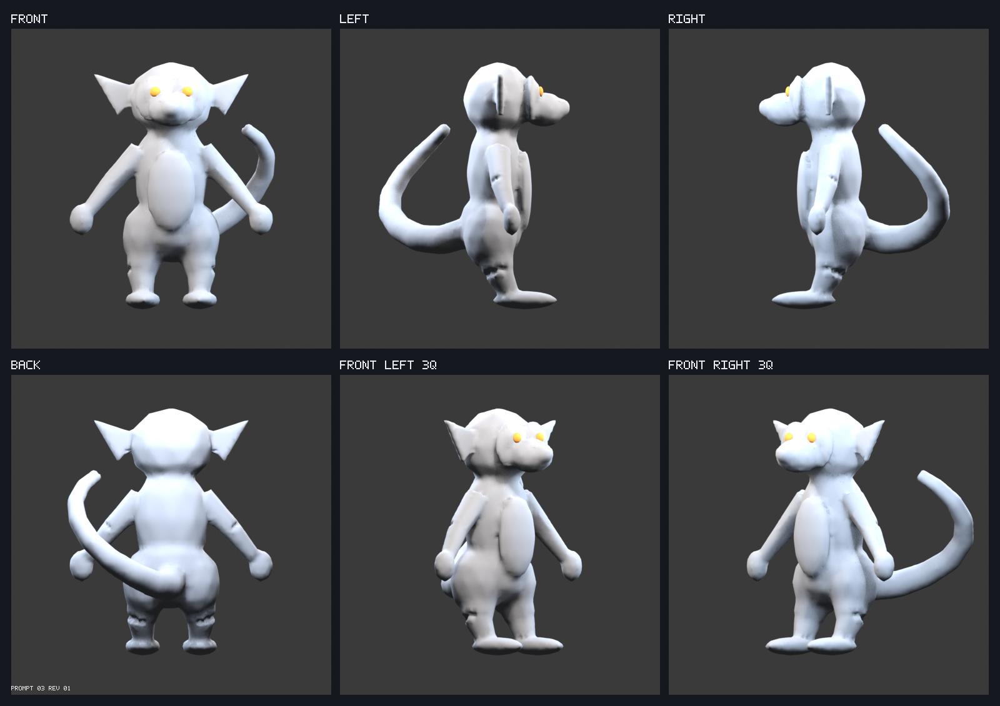

# Full-3D lemur — Prompt 03, revision 01

## Visual entry point

First inspect the [matched Prompt 02 silhouette comparisons](silhouette-comparison-contact-sheet.png). Then review the [all-view wireframe](wireframe-contact-sheet.png), [topology-density diagnostic](density-contact-sheet.png), and [eight-angle smooth turntable](turntable-contact-sheet.png). Each sheet is backed by full-resolution source renders in this directory.

## What changed

- The separate Prompt 02 primitives were converted into one primary mesh object named `LemurUnifiedTopology`.
- Body, head, muzzle, neck, ears, shoulders, arms, wrists, hands, pelvis, hips, legs, ankles, feet, and the complete tail now form one continuous manifold surface. Only the two embedded eye shells remain disconnected, yielding three intentional connected components in one mesh object.
- A fixed 5 cm union grid provides repeatable cross-section bands through planned joints. Smooth shading is used only for topology review; final authored triangulation and flat shading remain deferred to Prompt 05.
- Locked cameras, framing, lighting, modeling pose, coordinate convention, and staging-only output remain unchanged.

## Integrity and topology checks

- Source topology: `11950` vertices, `11835` base faces, `23888` export-equivalent triangles, and `3` intentional components.
- GLB: `529404` bytes, `11992` exported vertices, `23888` triangles, and `2` primitives.
- Integrity result: `True`. Non-manifold `0`, boundary `0`, exact duplicate vertices `0`, duplicate faces `0`, zero-area faces `0`, degenerate edges `0`, inconsistent-normal edges `0`, non-finite vertices `0`.
- Every named deformation zone (neck, paired shoulders/elbows/wrists/hips/knees/ankles, muzzle, ears, and tail base) passes the local vertex/edge coverage check. Exact per-zone counts are in `topology.integrity.joint_deformation_zones` in [metrics.json](metrics.json).
- Prompt 02-to-03 bounds deltas are `[-0.00675, -0.016177, -0.014156]` m on X/Y/Z. Use the matched locked-view sheet to judge silhouette preservation; numeric bounds alone do not approve it.
- Internal repeat export matched `3a1a6e4338a28ff659550645a9917bcfd163a2e3586b443ebd2d6164e5017266`. Production `public/models/lemur.glb` remained `3a8833d7d0e19a33f378da8133f945e66ce79ac5eb85ba85c4d3e6cee4f52f47`.

## Density diagnostic

The density sheet colors the exact base faces by area tertile: red is the finest third, amber the middle third, and blue the broadest third. It is an inspection aid for abrupt density changes and crowding; color is not exported as character styling.

## How to verify

1. Run `npm run assets:validate -- lemur-full-3d`.
2. Open `silhouette-comparison-contact-sheet.png` first and reject any unapproved Prompt 02 proportion or identity drift. Then inspect `wireframe-contact-sheet.png`, `density-contact-sheet.png`, `contact-sheet.png`, and their full-resolution sources.
3. Run `npm run dev` and open `http://localhost:5173/?review=lemur-full-3d`.
4. Enable wireframe, reset to all six canonical directions, and orbit closely around the neck, muzzle, eye sockets, ears, shoulders, elbows, wrists, hands, hips, knees, ankles, and tail base. Look for abrupt density changes, pinching poles, internal surfaces, cracks, or connections too thin to deform.
5. Approve or reject **Prompt 03 revision 01** explicitly. The requested approval is limited to silhouette preservation, unified topology, deformation-zone coverage, and mesh integrity; it does not approve final facial features, facets, markings, rigging, or animation.

## Known limitations

- The grid-derived quad flow is deterministic and manifold, but visual inspection must decide whether its flow is suitable enough for the planned deep bends.
- Eye shells are intentionally disconnected inside the same mesh. No other disconnected or open surface is intended.
- Eyelids, detailed fingers, meditation hand capability, and final feature refinement are Prompt 04 work.

## Review gate

Approve or reject whether the unified mesh preserves Prompt 02 identity and proportions, has usable density and edge flow at every planned deformation region, and is structurally eligible for rigging. Automated checks establish technical eligibility only.
