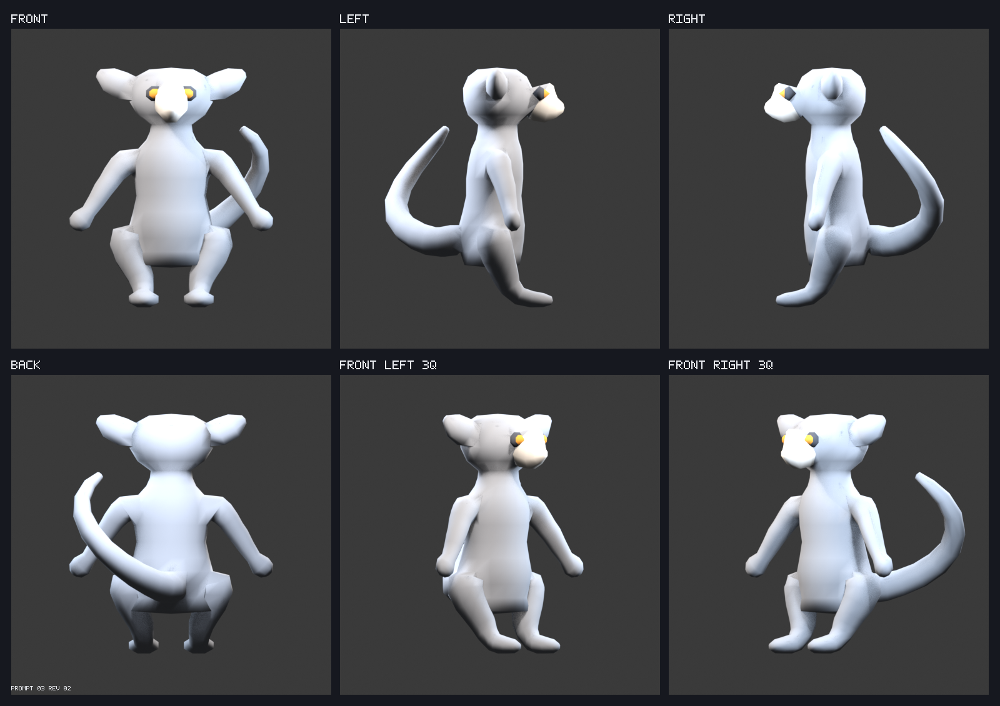

# Full-3D lemur — Prompt 03, revision 02

## Visual entry point

Inspect the [all-view wireframes](wireframe-contact-sheet.png), [labeled deformation-zone loops](deformation-zone-contact-sheet.png), [density diagnostic](density-diagnostic.png), [temporary flat triangulation](flat-triangulation-diagnostic.png), [temporary bend tests](bend-diagnostic.png), and [Prompt 02 silhouette differences](silhouette-differences.png).

## What changed

- Replaced Prompt 02's overlapping primitives with one source-authored deformation mesh. Torso, neck, head, muzzle, ears, limbs, and tail are continuous; only the two permitted embedded eye shells are disconnected components inside the same object.
- Every submitted vertex comes from a deterministic anatomical cross-section loop. No voxel remesh, isotropic remesh, subdivision, shrink-wrap, or proximity operation is used.
- Shoulder, hip, muzzle, ear, and tail branches use explicit 8-edge apertures and controlled 8-to-8 transition patches. Junction poles remain outside the three-loop maximum-bend bands.
- Five transition cells for which neither quad diagonal was valid are stored as deterministic triangle pairs outside the named maximum-bend cycles; all other deformation bands remain directed quads.
- Density is intentionally non-uniform: 16-point torso/head silhouettes and 8-point limb/feature cycles. Prompt 05 will triangulate these same quads, so the temporary flat diagnostic directly tests whether visible planes remain broad enough.

## Technical checks

- Source mesh: 846 vertices, 909 faces (771 quads and 138 deliberate cap/transition triangles), 3 components, and two intentional embedded eye shells.
- Integrity: 0 non-manifold edges, 0 boundary edges, 0 duplicate vertices, 0 duplicate faces, 0 zero-area faces, 0 degenerate edges, and 0 non-finite vertices.
- `metrics.json` records actual vertex-index cycles, loop counts, vertices per cycle, spacing, cross-section orientation, nearest pole distance, every transition patch, and all eight deterministic bend operations.
- Temporary bends cover 90° elbows and knees, raised shoulders, rotated hips, 20° neck rotation, wrist and ankle flexion, and 50° tail-base bending. They preserve closed connectivity and report no zero-area faces, cracks, severe section loss, or detected centerline collisions.
- The staging GLB was exported twice byte-identically: `196a9e10f9b41b194953f8c6452c64e4d37e86877fbda0a071c91cb525beb109`. Production `public/models/lemur.glb` remained `3a8833d7d0e19a33f378da8133f945e66ce79ac5eb85ba85c4d3e6cee4f52f47`.

## Density and final facets

Blue denotes broad faces, green intermediate faces, and orange concentrated deformation/detail faces. This same organized base surface is the planned visible surface: Prompt 05 will choose each remaining quad's deterministic triangle diagonal to reinforce anatomy while retaining the authored cap and transition triangles. There is no separate uniformly dense display mesh, so flat shading will not expose hidden micro-tessellation.

## How to verify

1. Run `npm run assets:validate -- lemur-full-3d`.
2. Open `silhouette-differences.png` first and reject any unacceptable Prompt 02 proportion drift. Then inspect `wireframe-contact-sheet.png`, every zone in `deformation-zone-contact-sheet.png`, `density-diagnostic.png`, `flat-triangulation-diagnostic.png`, and `bend-diagnostic.png`.
3. Run `npm run dev` and open `http://localhost:5173/?review=lemur-full-3d`. Enable wireframe, reset to all six canonical directions, and orbit the neck, shoulders, elbows, wrists, hips, knees, ankles, muzzle, eyes/lids, ears, and tail base.
4. Reject grid-like flow, abrupt density, a pole in a maximum-bend band, pinching/collapse, or facets that read as micro-noise at the intended full-character size.
5. Approve or reject **Prompt 03 revision 02** explicitly. This gate covers unified topology, loop direction, density, bend feasibility, and preservation of approved Prompt 02 proportions only.

## Known limitations

- The eye shells are intentionally disconnected embedded components; all deformation-continuous anatomy is joined.
- Temporary bend transforms are deterministic structural tests, not production skinning.
- Hands, feet, eyelid refinement, identity details, final triangulation, and markings remain in their named later prompts.

## Review gate

Approve or reject the directed deformation topology and facet-scale feasibility. Automated validation is technical eligibility, not visual approval.
